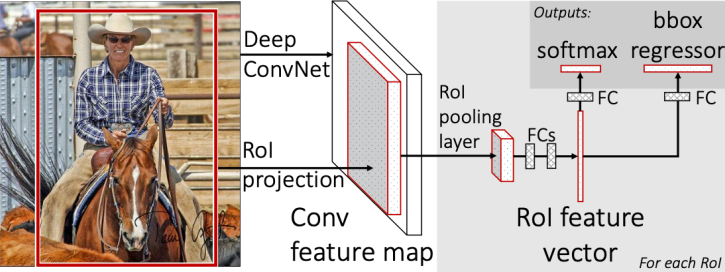
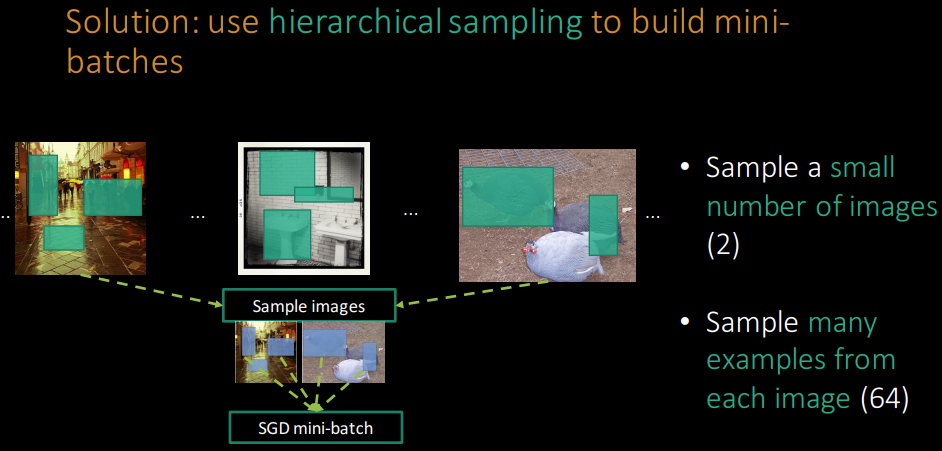

# Fast R-CNN

## Index
- Introduction
- Fast R-CNN architecture & Training
- Conclustion

## Introduction
- 이전 문제점
    - First, **numerouse candidate object locations(region proposals)** must be processed.
    - Second, these candidates provide only **rough localization**.
- 제안하는 방법
    - **Single-stage taining algorithm** that jointly learn to **classify object proposals and refine their spatial locations.**

- R-CNN's 문제점
    - Training is a multi-stage pipline
        - first fine-tunes a ConvNet on object proposals using log loss.
        - SVM
        - Bounding-box regressor
    - Training is expensive in space and time
        - For SVM and bounding-box regressor training, features are extraced from each object proposal
    - Object detection is slow
        - At test-time, features are extracted from each object proposal in each test image
- SPP-net 문제점
    - **Spatial pyramid pooling network**을 제안하면서 convolution연산을 공유할 수 있게함 --> 결과적으로 R-CNN보다 학습속도와 처리속도가 빨라짐
    - 하지만 R-CNN과 마찬가지로 **Multi-stage pipeline** 이다
        - Extracting fine tuning a network with log loss
        - Training SVMs
        - Fitting bounding-box regressors

## Fast R-CNN architecture & training

### Figure 1. Architecture
- 
    - 전체 이미지, Region proposal이미지를 한번에 받음
    - Convolution, max-pooling을 통해 이미지 전체에 대한 feature map을 생성
    - 각 RoI영역의 feature-map들은 RoI pooling layer를 디나 fixed-length featur vector를 추출함
    - fixed-length feature vector --> [Full-Connected Layer] --> softmax(object ckass, background classifier), bounding box regressor(object location)

- Training
    - R-CNN, SPP-Net은 mini-batch 크기를 설정할 때 128장의 학습 이미지에서 RoI를 무작위로 선택(region-wise sampling)
    - 이와 달리 Fast R-CNN은 2장의 학습 이미지에서 128(64+64)개의 RoI를 정하도록 함(hierarchical sampling)
    - 결과적으로 test-time, training-time에서 학습 영상의 결과를 공유할 수 있어 연산 속도가 빨라졌다고 함
    - 

# Reference
- [Fast R-CNN Paper](https://arxiv.org/abs/1504.08083)
- [Fast R-CNN Slides](http://www.robots.ox.ac.uk/~tvg/publications/talks/fast-rcnn-slides.pdf)