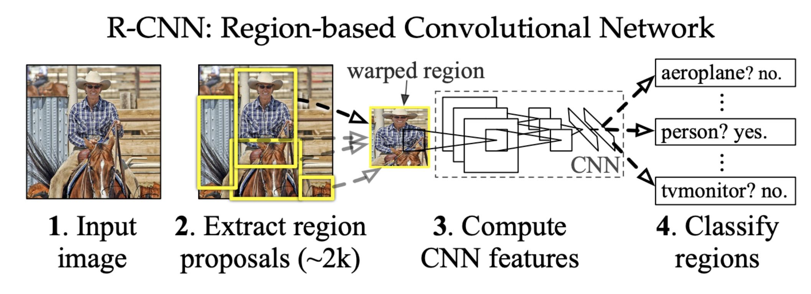

# R-CNN

## Index
- Introduction
- Object Detection Overview
- Bounding Box Regression
- Train & Test
- Experiment

## Introduction
- Multi-layer convolutional network compute feature
    - Detec bounding boxes
    - Pixel-level segmentation
- Three modules
    - Region proposal
    - Convolution neural network
    - Linear SVM

## Object Detection Overview

# Reference
- [Rich feature hierarchies for accurate object detection and semantic segmentation](https://arxiv.org/pdf/1311.2524.pdf)
- [Region-Based Convolutional Networks for Accurate Object Detection and Segmentation.](http://islab.ulsan.ac.kr/files/announcement/513/rcnn_pami.pdf)