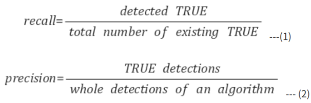
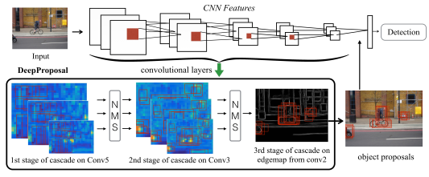

# DeepProposal: Hunting Object by Cascading Deep Convolutional Layers

## 용어 정리
- recall : 검출율(detection rate). 이미지에서 해당 물체를 빠뜨리지 않고 얼마나 잘 잡아내는지를 나타냄.
- precision : 정확도(accuracy). 검출된 결과가 얼마나 정확한지, 검출 결과들 중에 실제 물체가 얼마나 포함되어 있는지를 나타냄.

## Index
1. Abtract
2. Introduction
3. Basic Approach
4. Evaluation
5. Conclusion
    

## 1. Abtract
- 본 논문에서는 서로 다른 activate layer에 sliding window방식을 적용
- 이 방식은 마지막 conv layer는 높은 recall 값으로 관심 영역을 찾을 수 있음
- 하지만, coarase한 feature map으로 인해 poor localization 상태임
- recall이 감소 하는 대신에 네트워크 첫번째 layer는 관심 객체를 더욱 잘 localize할 수 있음
- 특징
    - 동일한 feature map을 재사용
    - Integral image를 사용하여 features를 집계함
    - 논문에서 제안하는 *Inverse coarse-to-fine cascade* 방식을 통해 proposals에 대하여 dense한 평가를 피할 수 있음

## 2. Introduction
- bbox annotation 정보 없이 학습하는 방법은 2-stage cascade로 접근할 수 있음
    - promissing & class-independent hypotheses들을 감소 시키는 방법
    - 각 hypothesis들을 클래스별로 분류 하는 방법
- 이러한 방법은 sliding window 방식과 유사하게 detection 문제를 classification 문제로 바꾸는데 이점을 갖고 있음
- 하지만, sliding window 방식과는 다르게 많은 양의 후보 영역들을 감소시키기 위해 time-consumming이 큼
- 그래서 본 논문에서는 적절한 feature를 사용하여 정확하고 빠른 top-down방식의 window proposal을 생성하는 방법을 제안함

- CNN layer로부터 생성된 feature-map에서 window size, aspect ratio, slide를 감소시키며 proposal을 생성함
- 개선된 후보 영역을 생성하기 위해 multiple layer를 사용함
- 하지만, 모든 feature layer에 있는 window 위치를 평가하기엔 비용이 너무 큼
- 그래서 cascade 방식을 제안함
    - last conv-layer(layer 5)에서 연속적으로 개선하며 inital layer까지 내려가는 방식
    - feature computation을 반대로 진행하기 때문에 *inverse cascade*라고 정의함
    - 또한, coarse한 window resolution을 시작으로 window hypotheses를 refine하며 감소시키고, 좋은 localized를 얻을 때 까지 진행함 --> ***coarse-to-fine inverse cascade*** 라고 정의함
- 제안하는 방식은 이미 CNN 으로부터 추출된 feature를 재사용 하기 때문에 더이상의 feature 계산이 필요가 없음

## 3. Basic Approach
- Sliding window
    - 크기, 종횡비를 고려하여 training data를 가장 잘 다루는 window size를 선택함.
    - 선택된 CNN layer에 대해 sliding window 방식을 적용함
- Multiple scales
    - 효율적인 sliding window를 위해 stride는 윈도우 크기에 비례해야함
    - 따라서, 실험에서 사용한 윈도우의 크기는 multiple-scale로 구성함
- Pooling
    - 처리 속도를 위해 window 안에 있는 Conv feature를 average pooling함 
- Pyramid
    - avg pooling은 객체의 중요한 영역을 dilute 하게 함
    - 그래서 논문에선 spatial pyramid를 고려함
        - 동일한 사이즈를 갖는 sub-window로 구성
        - 각각의 window는 다르게 빌드됨
- Classifier
    - positive smapling : 10 region per image(IoU > 0.7)
    - negative sampling : 50 region per image(IoU < 0.3)
    - 모든 실험은 linear SVM 사용

## 4. Evaluation
### Figure 2. 
- Fig.2(left)
    - top conv layers의 성능이 더 좋은 것을 확인 가능
- Fig.2(middle)
    - segmentation based가 더 우수하다고함 --> ??
    - lower levels layer에서 더 좋은 해상도를 갖기 때문에 align을 더 좋게 함
- Fig.3(right) 
    - 사용된 window 개수가 증가함에 따라 높은 비용, 높은 recall을 기록함
### Figure 3. 
- Fig.3(left)
    - sp_level=1 --> 2x2 pyramid, flat representation보다 5배 느림
    - sp_level=2 --> 4x4 pyramid, 21배 느림
    - 본 논문에서는 속도와 computational cost를 고려하여 sp_level=1을 사용함
- Fig.3(middle)
    - Stage 1: Dense sliding window on layer 5
    - Stage 2: Re-scoring selected windows on layer 3
    - Stage 3: Local refinement on layer 2
### Figure 4. 
- Fig.4(left, middle, right) IoU 0.7, 0.5, 0.7로 설정
- DeepProposal을 사용한 region proposal 생성하는 방법과 이전 방법의 성능 비교
### Table 2.Summary of the computational cost of each stage

---

### Table 3. 

- N@75%는 recall 75%를 달성하기 위한 proposal의 개수
- 표에 **Recall** 열은 proposal 2000개로 테스트 한 결과

## 5. Conclusion
- CNN activation feature기반의 DeepProposal를 제안하며 region proposal을 생성한느 방법을 제안함
- 제안 하는 방법은 하나의 feature로부터 localization, detection 두가지 기능을 모두하여 object detection을 위해 추가해야할 부분이 없음

# Reference
- DeepPropsoal: Hunting Objects by Cascading Deep Convolutional Layers [Paper](https://arxiv.org/abs/1510.04445)