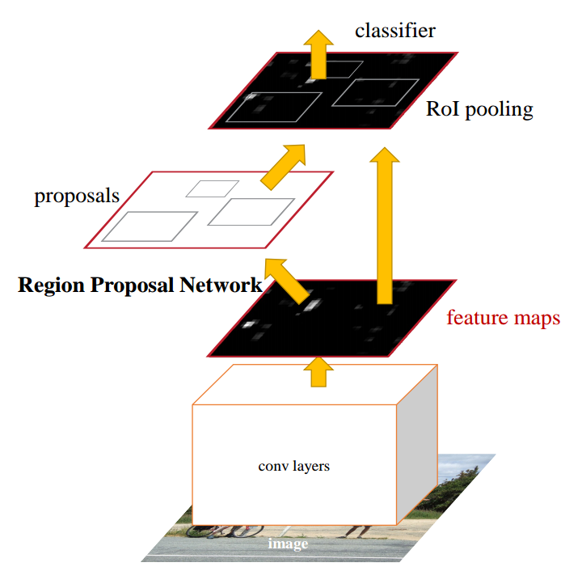
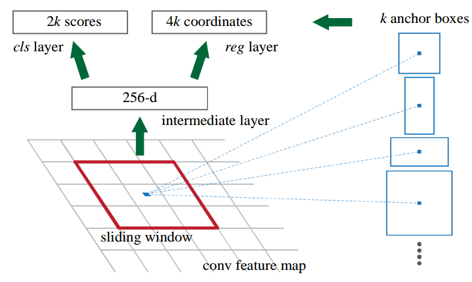
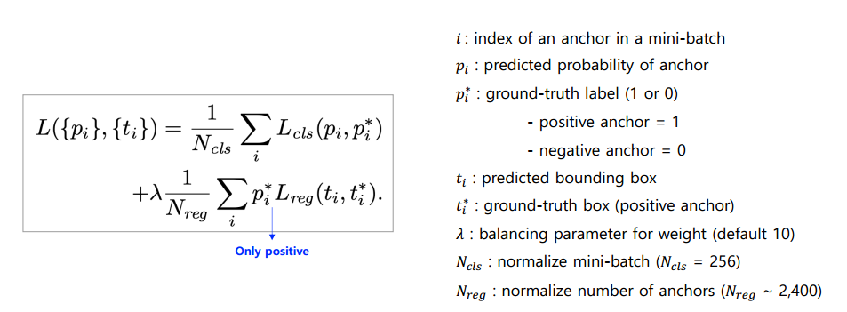
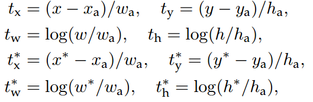
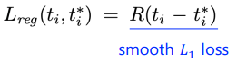
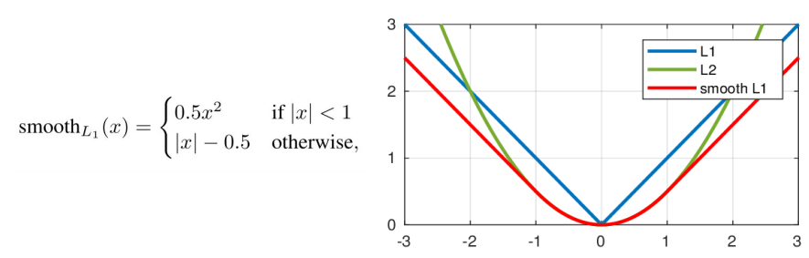
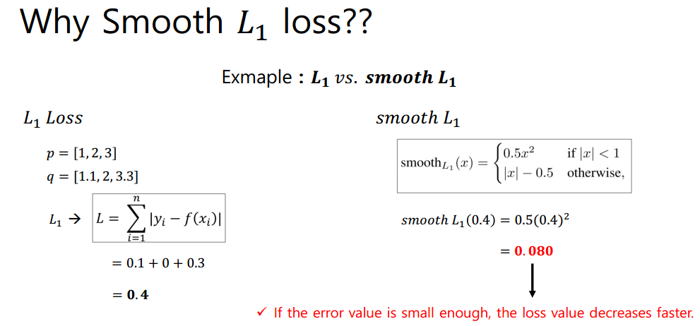

# Faster R-CNN

## Index
1. Introduction
2. Region Proposal Network & Anchor Box
3. Loss Function
4. Conclustion

## 1. Introduction
- R-CNN, Fast R-CNN은 region proposal을 생성하는 단계에서 너무 많은 계산량을 차지하게됨
- 따라서, Faster R-CNN에서는 Convolutional layer가 공유할 수 있는 **Region Proposal Networks(RPNs)** 를 제안함
- Convolutinos를 공유함으로서 컴퓨팅 비용을 줄임(이미지당 10ms)
- Region bounding boxes, objectness scores동시에 regress
- **Anchor box**라는 개념이 처음 등장
- training, test에서 single-sclae image를 사용하여 처리속도가 빠름

### Fingure 1. 
- 
    - RPN은 Object가 있을만한 영역에 대한 region proposal을 추출
    - RPN을 통해 나온 각 proposal들은 objectness score를 갖고 있음
    - region proposal --> [RoI pooling layer] --> (이후, Fast R-CNN과 동일)

## 2. Region Proposal Network & Anchor
### Figure 2.
- 
    - 각 sliding window에서 region propsoal 여러개를 동시에 예측함(*k*는 각 위치에 가능한 최대 region)propsoal의 개수
    - Output Layer
        - *reg* layer : 4*k* output(*k*개의 box x 각 box의 좌표)
        - *cls* layer : 2*k* scores(Object?, Not object?)
    - *k*개의 box를 기준으로 parameterize됨. 이를 **Anchor Box**라 정의함
    - Anchor Box는 미리 정해놓은 다양한 aspect ratio를 갖는 box임. 이를 이동하는 sliding window의 중심을 기준으로 anchor box들을 적용하여 feature를 추출함.
    - 사전에 다양한 aspect ratio를 갖는 anchor box를 정했기 때문에 input image의 크기를 변경하거나, sliding window의 filter의 크기를 변경할 필요가 없음 ==> 계산 효율이 좋음

## 3. Loss Function
### Fiture 3. Multi-task Loss
- 
    - 논문에서는 *Figure 3* 과 같이 loss function을 정의함
    - *Classification Loss*
        - *p* 로 인하여 오직 positive anchor에 대해서만 적용되는것을 확인할 수 있음
        - Object or Not object? 판단
    - Figure 3. *Bounding Box Regression Loss* 
        - *t* 는 위 수식을 통해 계산되는데, 목적은 anchor box를 ground-truth box로 최대한 가깝게 하기 위해서라고 함 (*a* : anchor box, * : ground-truth box, *(x, y)* 는 box의 중심 좌표)
        - Figure 4.  ==> 이후, *Smooth L1 Loss*를 적용함
        - Figure 5. *Smooth L1 Loss* 
            - Figure 5에서 확인할 수 있듯이 *Smooth L1* 은 -1 ~ 1 에서 2차함수 형태를 갖음
            - 결과적으로 이러한 형태의 그래프는 충분히 작은 error값들을 더욱 빠르게 감소 시킬 수 있게함
        - Fingure 6. ***L1 vs. Smooth L1*** 

## 4. Conclusion
- Region Proposal Network(RPN)을 제안하면서 효율적은 region proposal을 생성함
- RPN을 학습한 결과 region propsoal의 quality가 개선되었고, 결과적으로 object detection 성능이 향상됨
- 아직 real-time에는 부족하지만, 근접했다고 언급함

# Reference
- [Faster R-CNN Paper](https://arxiv.org/abs/1504.08083)