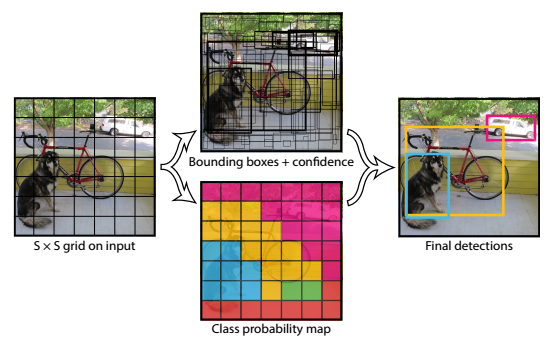

# YOLO : You Only Look Once: Unified, Real-Time Object Detection

## Index
- Introduction
- Unified Detection
- Experiments
- Conclustion

--- 

## Introduction

2-stage detection 방식은 region proposal을 추출하여 CNN 연산을 수행하는 방식이고, 이는 복잡한 구조를 갖고 있으며 시간 소요가 상당했습니다(R-CNN, Fast R-CNN, Faster R-CNN 등 참고). **YOLO는 이미지 내의 bounding box와 class probability를 single regression 문제로 접근하여 이미지를 한번 보는 것으로 object의 클래스와 위치를 예측하여 기존 방식보다 빠른 처리 속도를 보여줍니다..** 또한 YOLO는 Object가 표현하는 일반적인 것에 학습이 잘 이루어 진다고 합니다. 즉, 다른 도메인으로 일반화 할때 DPM, R-CNN 보다 성능이 좋다고 하네요.

---

## Unified Detection

아래 그림은 YOLO의 전체적인 수행과정을 보여줍니다. YOLO의 핵심은 입력 영상을 *S x S grid* 로 나누어 처리하는 것입니다.

 

***YOLO Detection System***  

 각각의 grid cell은 *B* 개의 Bbox(Bounding box)와 각각의 Bbox에 대한 *Confidence Score*를 갖게 됩니다. 만약 cell에 Object가 존재하지 않으면 *Confidence Score* = 0 이 됩니다. 
각각의 grid cell에는 *C* 개의 *Conditional Class Probability* 를 갖게 되는데, *B* (Bbox의 개수)와 상관없이 단지 하나의 grid cell에 대한 class probability만 나타낸다고 합니다. 결국 *C* 는 분류해야 할 모든 클래스의 개수를 뜻합니다. 
 ***Confidence Score***  
 ***Conditional Class Probability***  

Test time에는 *Confidence Score* 와 *Conditional Class Probability* 를 곱하여 예측 Bbox에 대한 ***Class-Specific Confidence Scores***를 출력하게 됩니다. 
 

정리하면 다음과 같습니다. 
하나의 Bbox는 *Center x, Center y, Width, Height, Confidence Score* 로 5개의 예측값을 갖게 됩니다. 결과적으로 *S x S* 개 만큼 grid cell 이 있고, 하나의 cell에는 *B* 개의 Bbox가 있고, Bbox는 5개의 에측 값을 갖고 있고, 다시 하나의 cell에는 *C* 개의 *Conditional Class Probability* 를 갖게 됩니다. 따라서, *S x S (B * 5 + C)* 개의 tensor를 갖게 됩니다.
  

아래 그림은 YOLO에서 사용한 Darknet Architecture를 보입니다. GoogLeNet을 일부 변형한 구조로 총 24개의 Convolutional layer와 2개의 Fully connected layer로 구성되어있습니다. feature space를 줄이기 위해 중간중간 1 x 1 Conv layer를 번갈아가며 사용한 것도 확인할 수 있습니다.

 

***YOLO Architecture***

Linear activation function으로 ***leaky ReLU***(*a* = 0.1)를 사용하고, Loss fucntion은 AP를 극대화 하기 보다는 최적화 하기 쉬운 ***sum-of-squared-error*** 의 개념을 사용했다고 합니다.

  

YOLO에서 사용한 Loss Function은 아래와 같으며, **Classification Loss, Localization Loss, Confidence Loss** 로 구성되어있습니다. Loss Function에 대한 설명은 [여기](https://medium.com/@jonathan_hui/real-time-object-detection-with-yolo-yolov2-28b1b93e2088) 설명을 참고하였습니다. 
수식에 사용된 *i*는 

 

***Loss Function***

**Classification Loss** 
각각의 grid cell에서 각각의 클래스에대한 *conditional probability* 를 *squared-error* 로 계산합니다. 

 

$a + b = c$

---