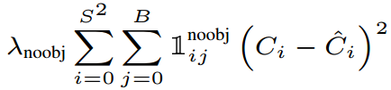

# YOLO : You Only Look Once: Unified, Real-Time Object Detection

## Index
- Introduction
- Unified Detection
- Experiments

--- 

## Introduction

2-stage detection 방식은 region proposal을 추출하여 CNN 연산을 수행하는 방식이고, 이는 복잡한 구조를 갖고 있으며 시간 소요가 상당했습니다(R-CNN, Fast R-CNN, Faster R-CNN 등 참고). **YOLO는 이미지 내의 bounding box와 class probability를 single regression 문제로 접근하여 이미지를 한번 보는 것으로 object의 클래스와 위치를 예측하여 기존 방식보다 빠른 처리 속도를 보여줍니다..** 또한 YOLO는 Object가 표현하는 일반적인 것에 학습이 잘 이루어 진다고 합니다. 즉, 다른 도메인으로 일반화 할때 DPM, R-CNN 보다 성능이 좋다고 하네요.

---

## Unified Detection

아래 그림은 YOLO의 전체적인 수행과정을 보여줍니다. YOLO의 핵심은 입력 영상을 *S x S grid* 로 나누어 처리하는 것입니다. 

YOLO Detection System

  

각각의 grid cell은 *B* 개의 Bbox(Bounding box)와 각각의 Bbox에 대한 *Confidence Score*를 갖게 됩니다. 만약 cell에 Object가 존재하지 않으면 *Confidence Score* = 0 이 됩니다. 
각각의 grid cell에는 *C* 개의 *Conditional Class Probability* 를 갖게 되는데, *B* (Bbox의 개수)와 상관없이 단지 하나의 grid cell에 대한 class probability만 나타낸다고 합니다. 결국 *C* 는 분류해야 할 모든 클래스의 개수를 뜻합니다. 
 ***Confidence Score***  
 ***Conditional Class Probability***  

Test time에는 *Confidence Score* 와 *Conditional Class Probability* 를 곱하여 예측 Bbox에 대한 ***Class-Specific Confidence Scores***를 출력하게 됩니다. 
 ***Class-Specific Confidence Scores*** 

정리하면 다음과 같습니다. 
하나의 Bbox는 *Center x, Center y, Width, Height, Confidence Score* 로 5개의 예측값을 갖게 됩니다. 결과적으로 *S x S* 개 만큼 grid cell 이 있고, 하나의 cell에는 *B* 개의 Bbox가 있고, Bbox는 5개의 에측 값을 갖고 있고, 다시 하나의 cell에는 *C* 개의 *Conditional Class Probability* 를 갖게 됩니다. 따라서, *S x S (B * 5 + C)* 개의 tensor를 갖게 됩니다.
  

아래 그림은 YOLO에서 사용한 Darknet Architecture를 보입니다. GoogLeNet을 일부 변형한 구조로 총 24개의 Convolutional layer와 2개의 Fully connected layer로 구성되어있습니다. feature space를 줄이기 위해 중간중간 1 x 1 Conv layer를 번갈아가며 사용한 것도 확인할 수 있습니다.

YOLO Architecture

  

Linear activation function으로 ***leaky ReLU***(*a* = 0.1)를 사용하고, Loss fucntion은 AP를 극대화 하기 보다는 최적화 하기 쉬운 ***sum-of-squared-error*** 의 개념을 사용했다고 합니다.
  

YOLO에서 사용한 Loss Function은 아래와 같으며, **Classification Loss, Localization Loss, Confidence Loss** 로 구성되어있습니다. Loss Function에 대한 설명은 [여기](https://medium.com/@jonathan_hui/real-time-object-detection-with-yolo-yolov2-28b1b93e2088) 설명을 참고하였습니다. 

Loss Function
  

**Classification Loss**는 각각의 grid cell에서 각각의 클래스에대한 *conditional probability* 를 *squared-error* 로 계산합니다. 
는 ***i*** 번째 cell에 있는 ***j*** 번째 Bbox에 Object가 있으면 1, 없으면 0 을 표현합니다.  는 ***i*** 번째 cell에 있는 class ***c*** 의 *Conditional Class Probability*를 나타냅니다. 

Classification Loss
  

**Localization Loss**는 예측된 Bbox의 위치 및 크기의 오류를 측정하는 역할을 합니다. 또한, Bbox의 정확도에 더 중점을두기 위해 (default = 5)를 곱하여 가중치를 높이게 됩니다. 

Localization Loss
  

**Confidence Loss**는 검출된 Bbox에 물체가 있을 경우로 나뉩니다. 
물체가 있을 경우, (cell ***i*** , Bbox ***j*** 의 *Confidence Score*)를 사용하여 아래와 같이 계산됩니다. 

Confidence Loss
  

물체가 없을 경우, 아래와 같은 식을 통해 가중치를 낮추는 역할을 하도록 합니다. 대부분의 Bbox에는 Background Detection이 발생해 클래스 불균형 문제가 발생되고, 이렇게 학습할 경우 모델이 원하는 객체보다 Background를 검출하는 방향으로 학습이 진행될 것입니다. 이 문제를 해결하기위해 (default = 0.5)를 곱하여 가중치를 낮추도록 합니다. 

Confidence Loss

  

YOLO는 또한 불필요한 Bbox들을 제거하기 위해 ***NMS(Non-maximal suppression)*** 를 사용했습니다. YOLO의 한계점은 하나의 grid cell에 2개의 Bbox가 존재하고, 1개의 클래스만 예측할 수 있기 때문에, 하나의 cell에 여러 객체가 포함되어 있을경우 검출하지 못하는 단점을 갖고 있다고 언급하고 있습니다.

---

## Experiments

PASCAL VOC 2007를 사용하여 다른 검출기들과 비교한 실험 결과입니다. **Faster R-CNN**보다는 미세하게 낮은 정확도를 기록하지만, 속도면에서는 **Fast YOLO, YOLO**이 압도적으로 빠른것을 확인할 수 있습니다. 

Real-Time Systems on PASCAL VOC 2007
  

아래 그림은 PASCAL VOC 2007을 사용하여 실험한 결과 **Faster R-CNN, YOLO**의 error율을 분석한 결과로 **Faster R-CNN**는 대부분 Background error를 보이고, **YOLO**는 대부분 Localization error를 보이는 것을 확인할 수 있습니다. 

Error Analysis: Fast R-CNN vs. YOLO
  

각각의 단점을 보완하기 위해 Faster R-CNN, YOLO를 함께 사용한 결과 아래와 같이 3.2mAP의 정확도를 향상시킬 수 있었습니다. 

Model combination experiments on VOC 2007
  

Faster R-CNN과 YOLO의 조합은 PASCAL VOC 2012 에서도 다른 검출기들고 비교하여 높은 정확도를 보이고 있습니다. 

PASCAL VOC 2012 Leaderboard
  

마지막으로 YOLO는 실제 다양한 환경에서 YOLO 모델이 얼마나 일반화를 잘 할 수 있는지 실험하기 위해 Picasso and People-Art 데이터셋을 사용하여 실제 사람 사진이 아닌, 인물화와 같은 그림에 대하여 AP를 측정하였습니다. 실험 결과 아래와 같이 다른 검출기와 비교하여 높은 AP를 보이고 있습니다. 

Generalization results on Picasso and People-Art datasets

---

## Reference
- [YOLO paper](https://arxiv.org/abs/1506.02640)
- [YOLO YouTube, Deep Sysmtems](https://www.youtube.com/watch?v=L0tzmv--CGY&t=16s)