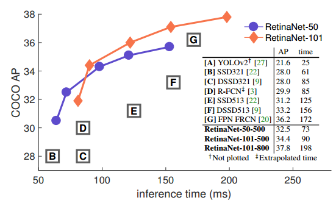
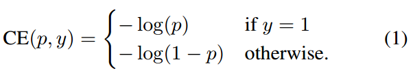
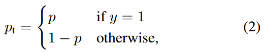
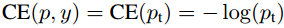
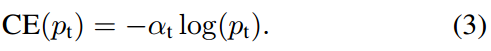
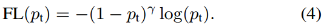
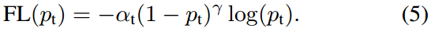
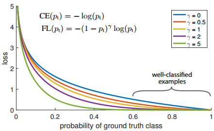
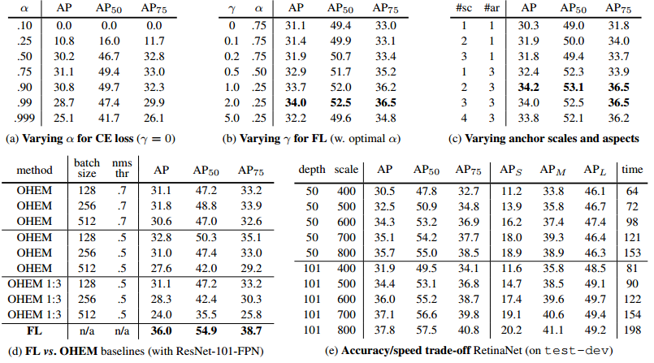
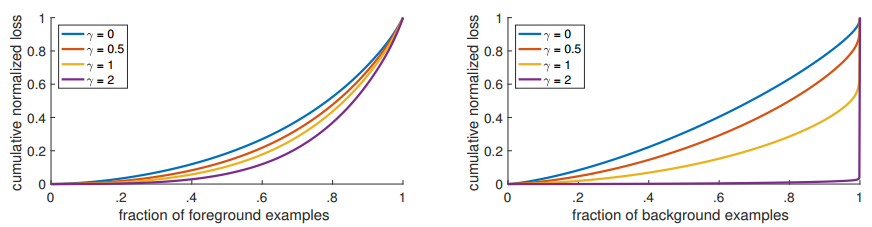

# Focal Loss for Dense Object Detection

## Index
- Introduction
- Focal loss
- RetinaNet
- Experiment
- Conclusion

## Intorduction
FAIR(Facebook AI Research)팀은 그동안 1-stage 방식이 2-stage보다 정확도가 낮은 이유는 **foreground-background class imbalance**임을 발견함. 따라서 학습을 진행할 때 쉬운 예제에는 낮은 가중치를, 어려운 예제에는 높은 가중치를 부여할 수 있는 새로운 loss function을 정의하고 이를 **Focal Loss** 라 명칭하고, Focal Loss를 사용하여 1-stage detection 방식인 **RetinaNet**을 설계함. 결과적으로 기존의 1,2-stage보다 높은 정확도와 빠른 처리속도를 기록함. 
 ***--> Speed(ms) versus AP***

---

## Focal Loss

(1)은 Binary Classification을 위한 CE loss(y = 1 or -1)를 나타내고, 편의를 위해 *Pt* 항을 (2)와 같이 정리하여 CE Loss를 세번째 식과 같이 간단하게 변경함. 
 ***--> Cross Enctropy(CE) loss*** 
 ***--> Class Probability*** 
 ***--> Rewrite CE Loss*** 

Class imbalance를 해결하기위해 일반적인 방법으로 0~1 사이값을 갖는 *a* 가중치(weighting factor)를 사용함. 따라서, *y=1* 일경우 *a*, *y=-1*일 경우 *1-a*을 적용하도록 *at*를 정의하고 (3)과 같이 CE Loss를 확장한 형태의 ***a-balance CE Loss***를 정의함. 
 ***--> a-balance CE Loss***

학습 과정에서 클래스 불균형 분제가 심각하면 easy sample들에 의해 CL Loss가 압도 되는 현상이 발생함. 위에서 정의한 *a-balance*는 positive-negative sample들의 중요도를 균형있게 조절하는 역할을 해주는데, 결국 easy-hard sample을 구분할 수 없음. 그래서 논문에서는 easy sample의 중요도를 낮추고, hard negative sample에 학습을 집중시킬 수 있도록 CE Loss에 *r(focusing parameter)* 를 사용한 *(1-pt)^r* 항을 추가하여 ***Focal Loss***를 제안함. 
 ***--> Focal Loss***

실험에서는 *a-balance* 를 추가한 Focal Loss도 사용하였는데, (4)보다 미세하게 성능이 좋았다고 함. 
 ***--> a-balanced variant of Focal Loss***

아래 그림에서 *r* = 0 => CE Loss 경우 쉽게 분류되는 예제들의 loss가 줄어들지 않는것을 학인할 수 있음. 반면에, Focal Loss는 *r (focusing parameter)* 를 조절하여 probability > 0.5 인 예제들의 loss를 줄일 수 있어 분류가 어려운 예제들게 학습을 집중 시킬 수 있다고함. 

---

## RetinaNet

논문에서는 1-stage 방식으로 클래스 불균형 문제를 해결하고자 아래그림과 같은 RetinaNet을 설계함. Multi-scale feature 추출을 위해 RestNet, FPN을 통합하여 backbone으로 사용하고 2개의 subnetwork로 구성됨.
각각의 pyramid level은 서로 크기의 객체를 검출하기 위해 사용되고, subnet은 calssification(top)과 bounding box regression(bottom)을 위해 사용됨. 
 ***--> RetinaNet architecture***

---

## Experiment

아래 실험결과의 (a), (b), (c)는 *a-balance*, *r (focusing parameter), a (weighting factor), 2-3 scale, 3 aspect ratio anchor*변화에 따른 AP측정 결과를 보이고, (d), (e)는 기존 OHEM(Online Hard Negative Mining)과 Focal Loss의 성능 비교 및 Network depth와 Image scale 변화에 따른 AP와 inference time 측정 결과를 보임. 
 ***--> Ablation experiments for RetinaNet and Focal Loss (FL)***

*r* 증가함에따라 positive sample의 영향은 거의 미미하지만, negative sample에게 멀리 하도록 하여 hard negative sample들에게 loss가 집중되는 것을 보임. 

1-stage, 2-stage detector들과 비교 실혐 결과를 보임. 

---

# Reference
- [Focal Loss for Dense Object Detection](https://arxiv.org/abs/1708.02002)